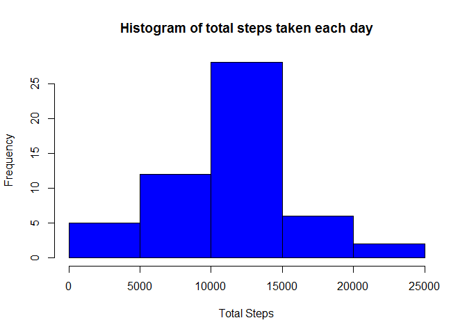
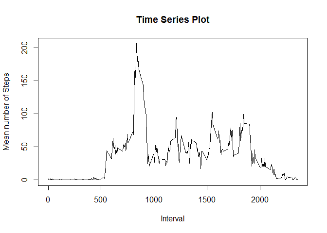
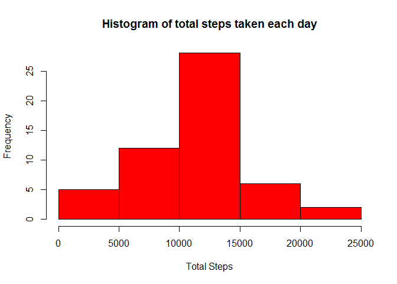
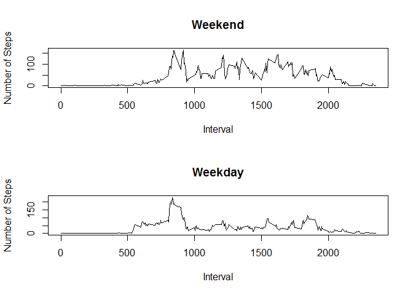

# Reproducible Research: Peer Assessment 1


## Loading and preprocessing the data
I first read in the dataset (activity.csv), which has the following variables:
    steps: Number of steps taking in a 5-minute interval (missing values are coded as NA)
    date: The date on which the measurement was taken in YYYY-MM-DD format
    interval: Identifier for the 5-minute interval in which measurement was taken


```r
stepData<-read.csv("activity.csv",header=TRUE)
```

## What is mean total number of steps taken per day?
I took the following statement: "you can ignore the missing values in the dataset." to mean that I should simply not have those days in the data.


I first summed up the total steps taken each day using aggregate. Then, I calculated the mean and median of the total steps (10766.1886792453 and 10765, respectively).


```r
steptotalData<-aggregate(steps~date,data=stepData,sum)
meanSteps<-mean(steptotalData$steps)
medianSteps<-median(steptotalData$steps)
```

I then constructed the histogram and printed the mean/median.


```r
hist(steptotalData$steps,main="Histogram of total steps taken each day",xlab="Total Steps",col="blue")
```

\

```r
print(paste("Mean of total steps taken each day =", meanSteps))
```

```
## [1] "Mean of total steps taken each day = 10766.1886792453"
```

```r
print(paste("Median of total steps taken each day=", medianSteps))
```

```
## [1] "Median of total steps taken each day= 10765"
```

## What is the average daily activity pattern?

I first found the average number of steps in each interval using aggregate. Then I calculated the interval that had (on average) the maximum number of steps (835). Finally, I plotted a time series plot with the interval on the x-axis and the average number of steps on the y-axis.


```r
stepMeanData<-aggregate(steps~interval,data=stepData,mean)
maxStepIndex<-which.max(stepMeanData[,2])
maxStepInterval<-stepMeanData$interval[maxStepIndex]
plot(stepMeanData$interval,stepMeanData$steps,type="l",xlab="Interval",ylab="Mean number of Steps",main="Time Series Plot")
```

\

```r
print(paste("Interval with maximum number of steps (on average): ", maxStepInterval))
```

```
## [1] "Interval with maximum number of steps (on average):  835"
```

## Inputting missing values
I first found the total number of NAs (2304).

```r
totalNAs<-sum(is.na(stepData$steps))
print(paste("Total number of NAs: ",totalNAs))
```

```
## [1] "Total number of NAs:  2304"
```
Then I filled in all the NAs with the mean number of steps for that interval.

```r
filledStepData<-stepData
filledStepData$steps[is.na(filledStepData$steps)]=stepMeanData$steps
```
Lastly, I calculated the total number of steps taken each day (with the filled in data) and made a histogram of this data and calculated the mean/median. The mean is 10766.1886792453 and the median is 10765. The mean and median did not change from the estimates in the first part. Inputting missing data added days that did not exist in the total steps data table before but did not change the mean, median, or the overall appearance of the histogram.

```r
filledTotalStepData<-aggregate(steps~date,data=filledStepData,sum)
meanFilledSteps<-mean(steptotalData$steps)
medianFilledSteps<-median(steptotalData$steps)

hist(steptotalData$steps,main="Histogram of total steps taken each day",xlab="Total Steps",col="red")
```

\

```r
print(paste("Mean of total steps taken each day =", meanFilledSteps))
```

```
## [1] "Mean of total steps taken each day = 10766.1886792453"
```

```r
print(paste("Median of total steps taken each day=", medianFilledSteps))
```

```
## [1] "Median of total steps taken each day= 10765"
```

## Are there differences in activity patterns between weekdays and weekends?
I first created a factor variable indicating whether a date is a weekday or weekend (using weekdays())

```r
filledStepData$DayType<-ifelse(weekdays(as.Date(filledStepData$date))==("Saturday"),"Weekend","Weekday")
filledStepData$DayType<-ifelse(weekdays(as.Date(filledStepData$date))==("Sunday"),"Weekend",filledStepData$DayType)
filledStepData$DayType<-as.factor(filledStepData$DayType)
```
I then made a panel plot containing a time series plot of the interval (x-axis) and the average number of steps taken, averaged across either weekend days or weekday days.

```r
weekendData<-filledStepData[filledStepData$DayType=="Weekend",]
weekdayData<-filledStepData[filledStepData$DayType=="Weekday",]
filledStepMeanDataWeekend<-aggregate(steps~interval,data=weekendData,mean)
filledStepMeanDataWeekday<-aggregate(steps~interval,data=weekdayData,mean)

par(mfrow=c(2,1))
plot(filledStepMeanDataWeekend$interval,filledStepMeanDataWeekend$steps,type="l",xlab="Interval",ylab="Number of Steps",main="Weekend")
plot(filledStepMeanDataWeekday$interval,filledStepMeanDataWeekday$steps,type="l",xlab="Interval",ylab="Number of Steps",main="Weekday")
```

\

